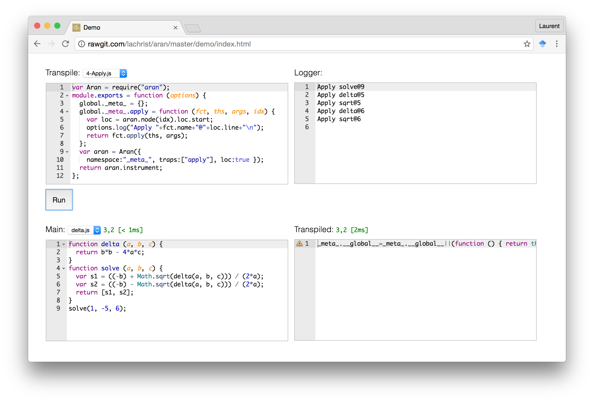

# Aran 

Aran is a npm module for instrumenting JavaScript code which enables amongst other things: profiling, tracing, sandboxing, and symbolic execution.
Aran performs a source-to-source code transformation fully compatible with [ECMAScript5](http://www.ecma-international.org/ecma-262/5.1/) and we are working toward supporting [ECMAScript6](http://www.ecma-international.org/ecma-262/6.0/).
To install, run `npm install aran`.
Note than Aran does not deal with module systems; alone, it can only handle monolithic JavaScript programs.
Various module systems are supported in a separate module called [Otiluke](https://github.com/lachrist/otiluke).

## Demonstration

In Aran, an analysis consists in a set of syntactic traps that will be triggered while the program under scrutiny is being executed.
For instance, the expression `x + y` may be transformed into `aran.binary('+', x, y)` which triggers the `binary` trap.
The best way to get familiar with Aran is by toying with its [demo page](http://rawgit.com/lachrist/aran/master/demo/index.html) built with [Otiluke](https://github.com/lachrist/otiluke).
The 'transpile' editor expects a script exporting an instrumentation function.
The monolithic program to instrument can be typed into the 'main' editor.
Note than 



## Usage

```javascript
var Aran = require("aran");
var aran = Aran({
  namespace: hiddenGlobalName,
  traps: trapNames,
  loc: isLoCNeeded,
  range: isRangeNeeded
});
var instrumentedCode = aran.instrument(script, source);
var maybeNode = aran.node(nodeIndex);
var maybeSource = aran.source(nodeIndex);
```

Aside from instrumenting, `aran.instrument` indexes every AST nodes and store them with the associated source.
Later, when traps are called, the index of the node responsible of triggering the trap is systematically given as last argument.
From this index, it is possible to retrieve the AST node with `aran.node` or the associated source with `aran.source`.
Here are the options recognized by the top-level function of this module:

 Option     | Default  | Value
------------|----------|---------------------------------------------------------------------------------------------------------------------
`namespace` | `"aran"` | String, the name of the global value containing Aran's traps
`traps`     | `[]`     | Array, contains the names of the traps to be called later, during the execution phase
`loc`       | `false`  | Boolean, if true: ast node have line and column-based location info [cf esprima](http://esprima.org/doc/index.html)
`range`     | `false`  | Boolean, if true: ast node have an index-based location range [cf esprima](http://esprima.org/doc/index.html)

To demonstrate how to use Aran we propose to log the function calls inside a program solving: `x^2 - 5*x + 6 = 0`.
Because Aran is fully written in JavaScript, the instrumentation can happen on the same process as the JavaScript program being analyzed.
In that case we say that the instrumentation is online.
By opposition, we refer to offline instrumentation when the instrumentation happens on a separate process.
Three different use examples are provided in this repository:

1. [Offline monolithic instrumentation](usage/offline-monolithic)
2. [Online monolithic instrumentation](usage/online-monolithic)
3. [Online modular instrumentation](usage/online-modular)

Note that if the program under analysis accesses the global variable holding the Aran's traps terrible things will happen.
First it could break the analysis by modifying the traps.
Second, more subtly, it changes the behavior of the program under analysis and the conclusion drawn during the analysis may not hold for the program alone.
The most straight forward way to prevent this to happen is to pick an extravagant name for this global variable.
However it is not a complete solution because the program under analysis may still access it by listing the property of the global object.
A complete solution can be obtained by controlling the access to the global object with the traps `read`, `write`, `enumerate` and `apply`.

## Traps

The below table introduces by example the set of traps Aran can insert.
Traps starting with a upper-case letter are simple observers and their return values are never used while the value returned by lower-case traps may be used inside expressions.
All traps are independently optional and they all receive as last argument an integer which is the index of the AST node that triggered the trap.
The AST node at a given index can be retrieved using `aran.node(index)`.
In the table below, `123` is used as a dummy index.

 Traps                              | Target              | Instrumented
------------------------------------|---------------------|-------------------------------------------------------
**General**                         |                     |
`Program(index)`                    | ...                 | `aran.Program(123); ...`
`Strict(index)`                     | `'use strict';`     | `'use strict';`<br>`aran.Strict(123);`
`expression(value, index)`          | `x`                 | `aran.expression(x, 123)`
**Creation**                        |                     |

`literal(value, index)`             | `'foo'`             | `aran.literal('foo', 123)`
**Environment**                     |                     |
`Declare(kind, variables, index)`   | `var x = 1, y;`     | `aran.Declare('var', [x,y], 123);`<br>`var x = 1, y;`
`read(variable, value, index)`      | `x`                 | `aran.read('x', x, 123)` |
`write(variable, old, new, index)`  | `x = y`             | `aran.write('x', x, y, 123)`
`Enter(index)`<br>`Leave(index)`    | `{ ... }`           | `{`<br>&nbsp;&nbsp;`aran.Enter(123);`<br>&nbsp;&nbsp;`...`<br>&nbsp;&nbsp;`aran.Leave(123);`<br>`}`
**Apply**                           |                     |
`apply(fct, this, args, index)`     | `f(x,y)`            | `aran.apply(f, null, [x,y], 123)`
`construct(fct, args, index)`       | `new F(x,y)`        | `aran.construct(F, [x,y], 123)`
`Arguments(value, index)`           | `function ...`      | `... aran.Arguments(arguments, 123)... `
`return(value, index)`              | `return x;`         | `return aran.return(x, 123);`
`eval(args, index)`                 | `eval(x, y)`        | `... eval(aran.eval([x,y], 123))... `
`unary(op, value, index)`           | `!x`                | `aran.unary('!', x, 123)`
`binary(op, left, right, index)`    | `x + y`             | `aran.binary('+', x, y, 123)`
**Object**                          |                     |
`get(object, key, index)`           | `o.k`               | `aran.get(o, 'k', 123)` 
`set(object, key, value, index)`    | `o.k = x`           | `aran.set(o, 'k', x, 123)`
`delete(object, key, index)`        | `delete o.k`        | `aran.delete(o, 'k', 123)`
`enumerate(object, index)`          | `for (k in o) ...`  | `... aran.enumerate(o, 123) ...`
**Control**                         |                     |
`test(value, index)`                | `if (x) ...`        | `if (aran.test(x, 123)) ...`
`Label(label, index)`               | `l: { ... };`       | `aran.Label('l', 123);`<br>`l: { ... };`
`Break(label, index)`               | `break l;`          | `aran.Break('l', 123);`<br>`break l;`
`throw(error, index)`               | `throw x;`          | `throw aran.throw(x, 123);`
`Try(index)`<br>`catch(error, index)`<br>`Finally(index)` | `try {`<br>&nbsp;&nbsp;`...`<br>`} catch (e) {`<br>&nbsp;&nbsp;`...`<br>`} finally {`<br>&nbsp;&nbsp;`...`<br>`}` | `try { `<br>&nbsp;&nbsp;`aran.Try(123);`<br>&nbsp;&nbsp;`...`<br>`} catch (e) {`<br>&nbsp;&nbsp;`e = aran.catch(e, 123);`<br>&nbsp;&nbsp;`...`<br>`} finally {`<br>&nbsp;&nbsp;`aran.Finally(123);`<br>&nbsp;&nbsp;`..`<br>`}`

In the case of a direct apply, the `this` argument provided to the `apply` trap is `undefined` in strict mode or else is `null`.
If one of the parameter is named `arguments`, the `arguments` trap is not triggered.
The finally trap is always triggered even if it its clause did not originally exist.
The below table depicts which traps are susceptible to be inserted for every [AST node type](https://developer.mozilla.org/en-US/docs/Mozilla/Projects/SpiderMonkey/Parser_API).
To further investigate how traps are inserted, please try it out in Aran's [demo page](http://rawgit.com/lachrist/aran/master/demo.html).

                         |`Strict`|`literal`|`unary`|`binary`|`Declare`|`read`|`write`|`Enter`|`Leave`|`apply`|`construct`|`Arguments`|`return`|`eval`|`get`|`set`|`delete`|`enumerate`|`test`|`Label`|`Break`|`throw`|`Try`|`catch`|`Finally`
-------------------------|:------:|:-------:|:-----:|:------:|:-------:|:----:|:-----:|:-----:|:-----:|:-----:|:---------:|:---------:|:------:|:----:|:---:|:---:|:------:|:---------:|:----:|:-----:|:-----:|:-----:|:---:|:-----:|:-------:
`EmptyStatement`         |        |         |       |        |         |      |       |       |       |       |           |           |        |      |     |     |        |           |      |       |       |       |     |       |         
`BlockStatement`         |        |         |       |        |         |      |       | X     | X     |       |           |           |        |      |     |     |        |           |      |       |       |       |     |       |         
`ExpressionStatement`    |        |         |       |        |         |      |       |       |       |       |           |           |        |      |     |     |        |           |      |       |       |       |     |       |         
`IfStatement`            |        |         |       |        |         |      |       |       |       |       |           |           |        |      |     |     |        |           | X    |       |       |       |     |       |         
`LabeledStatement`       |        |         |       |        |         |      |       |       |       |       |           |           |        |      |     |     |        |           |      | X     |       |       |     |       |         
`BreakStatement`         |        |         |       |        |         |      |       |       |       |       |           |           |        |      |     |     |        |           |      |       | X     |       |     |       |         
`ContinueStatement`      |        |         |       |        |         |      |       |       |       |       |           |           |        |      |     |     |        |           |      |       |       |       |     |       |         
`WithStatement`          |        |         |       |        |         |      |       |       |       |       |           |           |        |      |     |     |        |           |      |       |       |       |     |       |         
`SwitchStatement`        |        |         |       | X      |         |      |       | X     | X     |       |           |           |        |      |     |     |        |           | X    |       |       |       |     |       |         
`ReturnStatement`        |        |         |       |        |         |      |       |       |       |       |           |           | X      |      |     |     |        |           |      |       |       |       |     |       |         
`ThrowStatement`         |        |         |       |        |         |      |       |       |       |       |           |           |        |      |     |     |        |           |      |       |       | X     |     |       |         
`TryStatement`           |        |         |       |        |         |      |       |       |       |       |           |           |        |      |     |     |        |           |      |       |       |       | X   | X     | X       
`WhileStatement`         |        |         |       |        |         |      |       |       |       |       |           |           |        |      |     |     |        |           | X    |       |       |       |     |       |         
`DoWhileStatement`       |        |         |       |        |         |      |       |       |       |       |           |           |        |      |     |     |        |           | X    |       |       |       |     |       |         
`ForStatement`           |        |         |       |        | X       |      |       | X     | X     |       |           |           |        |      |     |     |        |           | X    |       |       |       |     |       |         
`ForInStatement`         |        |         |       |        | X       |      | X     | X     | X     |       |           |           |        |      |     | X   |        | X         |      |       |       |       |     |       |         
`DebuggerStatement`      |        |         |       |        |         |      |       |       |       |       |           |           |        |      |     |     |        |           |      |       |       |       |     |       |         
`FunctionDeclaration`    | X      | X       |       |        | X       |      | X     |       |       |       |           | X         |        |      |     |     |        |           |      |       |       |       |     |       |         
`VariableDeclaration`    |        |         |       |        | X       |      |       |       |       |       |           |           |        |      |     |     |        |           |      |       |       |       |     |       |         
`ThisExpression`         |        |         |       |        |         | X    |       |       |       |       |           |           |        |      |     |     |        |           |      |       |       |       |     |       |         
`ArrayExpression`        |        | X       |       |        |         |      |       |       |       |       |           |           |        |      |     |     |        |           |      |       |       |       |     |       |         
`ObjectExpression`       |        | X       |       |        |         |      |       |       |       |       |           |           |        |      |     |     |        |           |      |       |       |       |     |       |         
`FunctionExpression`     | X      | X       |       |        |         |      |       |       |       |       |           | X         |        |      |     |     |        |           |      |       |       |       |     |       |         
`SequenceExpression`     |        |         |       |        |         |      |       |       |       |       |           |           |        |      |     |     |        |           |      |       |       |       |     |       |         
`UnaryExpression`        |        |         | X     |        |         |      |       |       |       |       |           |           |        |      |     |     | X      |           |      |       |       |       |     |       |         
`BinaryExpression`       |        |         |       | X      |         |      |       |       |       |       |           |           |        |      |     |     |        |           |      |       |       |       |     |       |         
`AssignmentExpression`   |        |         |       | X      |         | X    | X     |       |       |       |           |           |        |      | X   | X   |        |           |      |       |       |       |     |       |         
`UpdateExpression`       |        | X       |       | X      |         | X    | X     |       |       |       |           |           |        |      | X   | X   |        |           |      |       |       |       |     |       |         
`LogicalExpression`      |        |         |       |        |         |      |       |       |       |       |           |           |        |      |     |     |        |           | X    |       |       |       |     |       |         
`ConditionalExpression`  |        |         |       |        |         |      |       |       |       |       |           |           |        |      |     |     |        |           | X    |       |       |       |     |       |         
`NewExpression`          |        |         |       |        |         |      |       |       |       |       | X         |           |        |      |     |     |        |           |      |       |       |       |     |       |         
`CallExpression`         |        |         |       |        |         | X    |       |       |       | X     |           |           |        | X    | X   |     |        |           |      |       |       |       |     |       |         
`MemberExpression`       |        |         |       |        |         |      |       |       |       |       |           |           |        |      | X   |     |        |           |      |       |       |       |     |       |         
`Identifier`             |        |         |       |        |         | X    |       |       |       |       |           |           |        |      |     |     |        |           |      |       |       |       |     |       |         
`Literal`                |        | X       |       |        |         |      |       |       |       |       |           |           |        |      |     |     |        |           |      |       |       |       |     |       |         

## Supported ECMAScript6 Features

* Block scoping [let && const](https://developer.mozilla.org/en/docs/Web/JavaScript/Reference/Statements/let)
