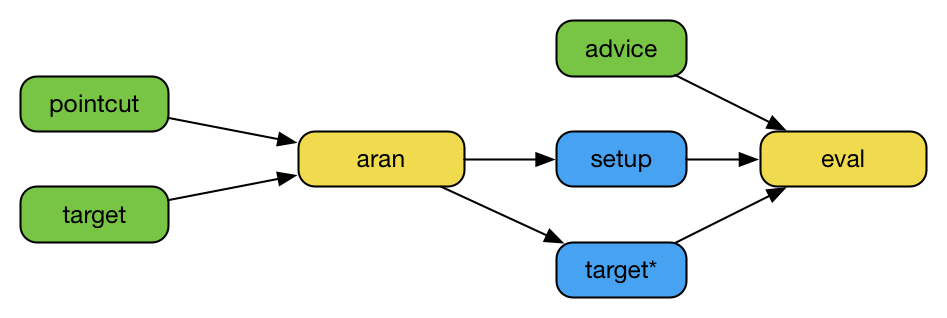

# Aran 

Aran is a [npm module](https://www.npmjs.com/package/aran) for instrumenting JavaScript code.
To install, run `npm install aran`.
Aran was designed as a generic infra-structure to build various development-time dynamic program analyses such as: objects and functions profiling, debugging, control-flow tracing, taint analysis and concolic testing.
Aran can also be used at deployment-time but be mindful of performance overhead.
For instance, Aran can be used to carry out control access systems such as sandboxing.
Aran can also be used as a desugarizer much like [babel](https://babeljs.io).

## Getting Started

```sh
npm install aran
```

```js
const AranLive = require("aran/live");
const aranlive = AranLive({
  binary: (operator, left, right, serial) => {
    console.log(operator + " @"+serial);
    return eval("left "+operator+" right");
  }
});
global.eval(aranlive.instrument("'Hello' + 'World!'"));
```

The code transformation performed by Aran essentially consists in inserting calls to functions called *traps* at [ESTree](https://github.com/estree/estree) nodes specified by the user.
For instance, the expression `x + y` may be transformed into `META.binary("+", x, y, 123)`.
The last argument passed to traps is always a *serial* number which uniquely identifies the node which triggered the trap.
The object that contains traps is called *advice* and the specification that characterizes what trap should be triggered on each node is called *pointcut*.
The process of inserting trap calls based on a pointcut is called *weaving*.
This terminology is borrowed from [aspect-oriented programming](https://en.wikipedia.org/wiki/Aspect-oriented_programming).
[demo/dead/apply](https://cdn.rawgit.com/lachrist/aran/f7381fdc/demo/output/dead-apply-factorial.html) demonstrates these concepts.



When code weaving happens on the same process that evaluates weaved code, it is called *live weaving*.
This is the case for [instrument/apply-explicit.js](https://cdn.rawgit.com/lachrist/aran/f7381fdc/demo/output/live-apply-explicit-factorial.html) which performs the same analysis as [demo/dead/apply](demo/dead/apply).
Live weaving enables direct communication between an advice and its associated Aran's instance.
For instance, `aran.node(serial)` can be invoked by the advice to retrieve the line index of the node that triggered a trap.
An other good reason for the advice to communicate with Aran arises when the target program performs dynamic code evaluation -- e.g. by calling the evil [eval](https://developer.mozilla.org/en-US/docs/Web/JavaScript/Reference/Global_Objects/eval) function.

When performing live weaving, Aran offers a simpler interface which hides the complexity linked to pointcut and setup.
This alternative API also performs parsing with [acorn](https://github.com/acornjs/acorn) and code generation with [astring](https://github.com/davidbonnet/astring). 
This simpler API is demonstrated at [demo/live/instrument/apply.js](https://cdn.rawgit.com/lachrist/aran/f7381fdc/demo/output/live-apply-factorial.html).

## Demonstrators

* [demo/live/instrument/empty.js](https://cdn.rawgit.com/lachrist/aran/f7381fdc/demo/output/live-empty-empty.html): Do nothing.
  Empty advice.
  Can be used to inspect how Aran desugars JavaScript.
* [demo/live/instrument/forward.js](https://cdn.rawgit.com/lachrist/aran/f7381fdc/demo/output/live-forward-empty.html):
  Transparent implementation of all the traps.
  Can be used to inspect how Aran inserts traps.
  The last lines can be uncommented to turn this analysis into a tracer.
* [demo/live/instrument/sandbox.js](https://cdn.rawgit.com/lachrist/aran/f7381fdc/demo/output/live-sandbox-global.html):
  Demonstrate sandboxing by restricting access to `Date`.
* [demo/live/instrument/eval.js](https://cdn.rawgit.com/lachrist/aran/f7381fdc/demo/output/live-eval-dynamic.html):
  Transitively intercepting dynamic code evaluation.
  [Script element](https://developer.mozilla.org/en-US/docs/Web/HTML/Element/script) insertion is not handled.
* [demo/live/instrument/shadow-value.js](https://cdn.rawgit.com/lachrist/aran/f7381fdc/demo/output/live-shadow-value-delta.html):
  Track program values across the value stack and the environment but not the store (the shadow value way).
* [demo/local/instrument/shadow-state.js](https://cdn.rawgit.com/lachrist/aran/f7381fdc/demo/output/live-shadow-state-delta.html):
  Track program values across the value stack and the environment but not the store (the shadow state way).
  This analysis provides the same output as the previous one.

## Limitations

1) Aran performs a source-to-source code transformation fully compatible with [ECMAScript5](http://www.ecma-international.org/ecma-262/5.1/) and most of [ECMAScript2017](https://www.ecma-international.org/ecma-262/8.0/).
   Known missing features are:
   * Native modules ([`import`](https://developer.mozilla.org/en-US/docs/Web/JavaScript/Reference/Statements/import), [`export`](https://developer.mozilla.org/en-US/docs/Web/JavaScript/Reference/Statements/export)).
   * [Classes](https://developer.mozilla.org/en-US/docs/Web/JavaScript/Reference/Classes).
   * Generator functions ([`function*`](https://developer.mozilla.org/en-US/docs/Web/JavaScript/Reference/Statements/function*), [`yield`](https://developer.mozilla.org/en-US/docs/Web/JavaScript/Reference/Operators/yield),[`yield*`](https://developer.mozilla.org/en-US/docs/Web/JavaScript/Reference/Operators/yield*)).
   * Asynchronous functions ([`async function`](https://developer.mozilla.org/en-US/docs/Web/JavaScript/Reference/Statements/async_function), [`await`](https://developer.mozilla.org/en-US/docs/Web/JavaScript/Reference/Statements/async_function)).
   * [Template literals](https://developer.mozilla.org/en-US/docs/Web/JavaScript/Reference/Template_literals).
2) There exists loopholes that will cause the target program to behave differentially when analyzed, this is discussed in [Known Heisenbugs](#known-heisenbugs).
3) Aran does not provide any facilities for instrumenting modularized JavaScript applications.
   To instrument server-side node applications and client-side browser applications we rely on a separate module called [Otiluke](https://github.com/lachrist/otiluke).
4) Aran does not offer an out-of-the-box interface for tracking primitive values through the object graph.
   This feature is crucial for data-flow centric dynamic analyses such as taint analysis and symbolic execution.
   In our research, we track primitive values through the object graph with a complementary npm module called [Linvail](https://github.com/lachrist/linvail).

## Simplified Live API

This simpler interface is provided by [live.js](live.js) which is a tiny wrapper around the regular Aran interface.

### `aranlive = require("aran/live")(advice, options)`

Create a new AranLive instance.
* `advice ::  object`: the object containing the traps.
  If `options.sandbox` is truthy, `advice.SANDBOX` will be used as the top frame of every environment.
* `options :: object | undefined`: regular aran's options; see `require("aran")(options)`

### `output = aranlive.instrument(script, parent, options)`

Desugar and insert calls to traps present in the advice.
* `script :: string`: the target code to weave.
* `parent :: object | number | undefined`: the parent's node of the target; only for direct eval call.
* `options :: object | undefined`: acorn's parsing options.
* `output :: string`: the weaved code containing trap calls.

### `node = aranlive.node(serial)`

Retrieve a node from its serial number; same as `aran.node(serial)`.
* `serial :: number`
* `node :: object | undefined`

### `root = aranlive.root(serial)`

Retrieve the ESTree Program node that contains the node at the given serial number; same as `aran.root(serial)`.
* `serial :: number`
* `root :: object | undefined`

### `namespace = aranlive.namespace`

The name of the global variable holding the advice; same as `aran.namespace`
* `namespace :: string`

## Regular API

### Syntactic Nodes

Aran visits the *statement nodes* and *expression nodes* of a given ESTree.
Within an ESTree, a node is called statement node if it can be replaced by any other statement while conserving the syntactic validity of the program.
Same goes for expression nodes.
The only exception being [getters](https://developer.mozilla.org/en-US/docs/Web/JavaScript/Reference/Functions/get) and [setters](https://developer.mozilla.org/en-US/docs/Web/JavaScript/Reference/Functions/set) which are considered node expressions even though they cannot be replaced by non-function expressions.
When Aran instruments a program, all its statement nodes and all its expression nodes will be annotated with the following fields:

* `AranSerial :: number`:
  The node's serial number.
* `AranSerialMax :: number`:
  The maximum serial number which can be found within the node's decedents.
  This is useful to speed up node search.
* `AranParent :: ESTree | *`:
  The node's parent.
  If the node is of type `"Program"`, then this field will be the third argument passed to `aran.weave`. 
  This field is not enumerable to prevent `JSON.stringify` from complaining about circularity.
* `AranParentSerial :: number | null`:
  The parent's serial number of the node (if any).
* `AranStrict :: boolean`:
  Indicates whether the node is in [strict mode](https://developer.mozilla.org/en-US/docs/Web/JavaScript/Reference/Strict_mode) or not.

### `aran = require("aran")(options)`

Create a new Aran instance.
* `options.namespace :: string`, default `"META"`:
  The name of the global variable holding the advice.
  Code instrumented by this aran instance will not be able to read, write or shadow this variable.
* `options.output :: string`, default `"EstreeOptimized"`:
  The output format of `aran.weave` and `aran.setup`.
  Valid values are:
  * `"ESTree"`:
    Regular ESTree.
  * `"ESTreeOptimized"`:
    An optimized and more compact ESTree.
    The performance cost of the optimization pass should barely be noticeable. 
  * `"ESTreeValid"`:
    Same as `"ESTree"` but performs various checks before constructing each node.
    This is useful to debug Aran itself.
  * `"String"`:
    Directly produces an unoptimized and compact code string.
    This should result in a slightly faster instrumentation than the other output options.
* `options.nocache :: boolean`, default `false`:
  A boolean indicating whether aran should keep an array of nodes indexed by serial number.
  A truthy options will result in a faster execution of `aran.node`.
* `options.sandbox :: boolean`, default `false`:
  A boolean indicating whether the user will provide a custom `GLOBAl` property to the advice to serve as [global object](https://developer.mozilla.org/en-US/docs/Glossary/Global_object) for the instrumented code.
  If this options is truthy, code weaved without parent will contain a [with statement](https://developer.mozilla.org/en-US/docs/Web/JavaScript/Reference/Statements/with) whose environment object is a [proxy](https://developer.mozilla.org/en-US/docs/Web/JavaScript/Reference/Global_Objects/Proxy).
  This proxy will also solve a transparency breakage by restoring identifiers sanitized by Aran.
  This is expected to produce noticeable performance overhead.

### `output = aran.setup()`

Build the setup code that should be evaluated before any instrumented code.
* `output :: *`:
  The setup code whose format depends on `options.output`.

The setup code with `options.namespace` being `META` looks like:

```js
META.EVAL                    = META.EVAL                   || eval;
META.GLOBAL                  = META.GLOBAL                 || META.EVAL("this");
META.PROXY                   = META.PROXY                  || Proxy;
META.REFERENCE_ERROR         = META.REFERENCE_ERROR        || ReferenceError;
META.OBJECT_DEFINE_PROPERTY  = META.OBJECT_DEFINE_PROPERTY || Object.defineProperty;
META.REFLECT_APPLY           = META.REFLECT_APPLY          || Reflect.apply;
META.WITH_HANDLERS           = {...};
META.SANDBOX_HANDLERS        = {...}; // if options.sandbox is truthy
META.STRICT_SANDBOX_HANDLERS = {...}; // if options.sandbox is truthy
```

### `output = aran.weave(estree, pointcut, parent)`

Desugar and insert calls to trap functions at nodes specified by the pointcut.
* `estree :: estree.Program`:
  The [ESTree Program](https://github.com/estree/estree/blob/master/es2015.md#programs) to instrument.
* `pointcut :: array | function | object | *`, default `false`:
  The specification that tells Aran where to insert trap calls.
  Four specification formats are supported:
  * `array`:
    An array containing the names of the traps to insert at every applicable cut point.
    For instance, the poincut `["binary"]` indicates aran to insert the `binary` traps whenever applicable.
  * `function`:
    A function that tells whether to insert a given trap at a given node.
    For instance, the pointcut below results in aran inserting a call to the `binary` trap at every update expression:
    ```js
    const pointcut = (name, node) => name === "binary" && node.type === "UpdateExpression" ;
    ```
  * `object`:
    An object whose keys are trap names and values are functions receiving nodes.
    As for the `function` format, these functions should return a boolean indicating whether to insert the call.
    For instance, the pointcut below has the same semantic as the one above:
    ```js
    const pointcut = { binary: (node) => node.type === "UpdateExpression" };
    ```
  * `*`:
    If truthy, all traps are to be inserted when applicable,
    If falsy, insert never insert any trap.
* `parent :: ESTree | number | null`, default `null`:
  In the event of instrumenting code before passing it to a direct eval call, this argument should be thuthy; else falsy.
  As this value is assigned to the `AranParent` property of the given `estree` argument, it makes sens to pass the estree node which triggered the direct eval call.
  If it is a number, aran will assume it is a serial number and pass it to `aran.node(serial)` first.
* `output :: *`:
  The instrumented output whose format depends on `options.output`.

### `node = aran.node(serial)`

Retrieve a node from its serial number.
If `options.nocache` is truthy, this method will explore the ESTrees which has a complexity growing linearly with the depth of the trees.
If `options.nocache` is falsy, this methods resolves to a much quicker array access.
* `serial :: number`
* `node :: ESTree | undefined`

### `root = aran.root(serial)`

Retrieve the ESTree Program node that contains the node at the given serial number.
* `serial :: number`
* `root :: ESTree.Program | undefined`

### `namespace = aran.namesapce`

The name of the glboal variable holding the advice;
* `namespace :: string`

## Advice

The most important part of the advice are the trap functions.
All traps are independently optional and they all receive as last argument an integer which is the index of the ESTree node that triggered the trap.
We categorized traps depending on their insertion mechanism.

* *Combiners*: replacements for expression nodes.
  These traps are given several values from the target program which they can freely combine.
  Their transparent implementation consists in reproducing the effect of the expression they replace.
  For instance:
  ```js
  // o.k(x) >> META.invoke(o, "k", [x], 123);
  META.invoke = (object, key, values, serial) => object[key](...values);
  ```
  Combiners pop some values from the value-stack and push exactly one value on top of it.
  The only exception is the `arrival` trap which pops no values from stack and push four values on top of it.
* *Modifiers*: surround expression nodes.
  These traps are given a single value from the target program which they can freely modify.
  Their transparent implementation consists in returning the second last argument.
  For instance:
  ```js
  // x >> META.read("x", x, 123)
  META.read = (identifier, value, serial) => value;
  ```
  Additionally most modifiers fall into the two subcategories based on their impact on the value stack:
  * *Producers*: produce a value on top of the value stack -- e.g.: `primitive`.
  * *Consumers*: consume the value on top of the value stack -- e.g.: `test`.
* *Informers*: result is not used.
  These traps are only given static syntactic information.
  Their transparent implementation consists in doing nothing.
  For instance:
  ```js
  // break a; >> META.break(false, "a", 123); break a;
  META.break = (iscontinue, label, serial) => {};
  ```
  Informers don't have any effect on the value stack.

### Trap Insertion

Name          | Original             | Instrumented
--------------|----------------------|-------------
**Combiners** |                      |
`arrival`     | `...`                | `... const arrival = META.arrival(@strict, callee, new.target === undefined, this, arguments, @serial); ...`
`apply`       | `f(x,y)`             | `META.apply(f, [x,y], @serial)`
`invoke`      | `o.k(x,y)`           | `META.invoke(o, "k", [x,y], @serial)`
`construct`   | `new F(x,y)`         | `META.construct(F, [x,y], @serial)`
`unary`       | `!x`                 | `META.unary("!", x, @serial)` 
`binary`      | `x + y`              | `META.binary("+", x, y, @serial)` 
`get`         | `o.k`                | `META.get(o, "k", @serial)`
`set`         | `o.k = x`            | `META.set(o, "k", x, @serial)`
`delete`      | `delete o.k`         | `META.delete(o, "k", @serial)`
`object`      | `{k:x,l:y}`          | `META.object([["k", x], ["l", y]], @serial)`
`array`       | `[x,y]`              | `META.array([x,y], @serial)`
**Modifiers** |                      | 
`copy`        | `for (x in o) ...`   | `... META.copy(1, ..., @serial) ...`
`drop`        | `f();`               | `META.drop(f(), @serial);`
`swap`        | `for (x in o) ...`   | `... META.swap(1, 2, ..., @serial)`
*Producers*   |                      | 
`begin`       | `...`                | `... META.begin(@strict, @direct, META.GLOBAL, @serial); ...`
`read`        | `x`                  | `META.read("x", x, @serial)`
`discard`     | `delete x`           | `META.discard("x", delete x, @serial)`
`load`        | `[x1,x2] = xs`       | `... META.load("Symbol.iterator", META["SAVE_Symbol.iterator"], @serial) ...` 
`catch`       | `... catch (e) ...`  | `... catch (error) { let e = META.catch(error, @serial); ...`
`primitive`   | `"foo"`              | `META.primitive("foo", @serial)`
`regexp`      | `/abc/g`             | `META.regexp(/abc/g, @serial)`
`closure`     | `() => {}`           | `META.closure(..., @serial)`
*Consumers*   |                      | 
`save`        |                      | `... META.SAVE_Symbol_iterator = META.save("Symbol.iterator", Symbol.iterator, @serial); ...`
`declare`     | `let x = y`          | `let x = META.declare("let", "x", y, @serial)`
`write`       | `x = y`              | `x = META.write("x", y, @serial)`
`test`        | `x ? y : z`          | `META.test(x, @serial) : y : z`
`with`        | `with (x) { ... }`   | `with(new META.PROXY(META.with(x, @serial), META.WITH_HANDLERS)) { ... }`
`throw`       | `throw x`            | `throw META.throw(x, @serial)`
`return`      | `return x`           | `return META.return(x, @serial)`
`eval`        | `eval(x)`            | `$$eval === META.SAVE_eval ? eval(META.eval(x, @serial)) : $$eval(x)`
`completion`  | `"foo";`             | `completion = META.completion("foo", @serial);`
`success`     | `...`                | `... completion = META.success(@strict, @direct, completion, @serial); ...`
`failure`     | `...`                | `... catch (error) { throw META.failure(@strict, @direct, error, @serial); } ...`
**Informers** |                      |
`end`         | `...`                | `... finally { META.end(@strict, @direct, @serial); } ...`
`try`         | `try { ...`          | `try { META.try(@serial) ...`
`finally`     | `... finally { ...`  | `... finally { META.finally(@serial) ...`
`block`       | `{ ... }`            | `{ META.block(@serial) ... }`
`leave`       | `{ ... }`            | `{ ... META.leave("block", @serial); }`
`label`       | `l: { ... }`         | `bl: { META.label(false, "l", @serial); ... }`
`break`       | `break l;`           | `META.break(false, "l", @serial); break bl;`

### Trap Signature

Name          | arguments[0]         | arguments[1]        | arguments[2]        | arguments[3]    
--------------|----------------------|---------------------|---------------------|-----------------
**Combiners** |                      |                     |                     |                 
`arrival`     | `strict:boolean`     | `callee:value`      | `new:boolean`       | `this:value` `arguments:value` `serial:number`
`apply`       | `function:value`     | `arguments:[value]` | `serial:number`     |
`invoke`      | `object:value`       | `key:value`         | `arguments:[value]` | `serial:number`
`construct`   | `constructor:value`  | `arguments:[value]` | `serial:number`     |                
`unary`       | `operator:string`    | `argument:value`    | `serial:number`     |                
`binary`      | `operator:string`    | `left:value`        | `right:value`       | `serial:number`
`get`         | `object:value`       | `key:value`         | `serial:number`     |                
`set`         | `object:value`       | `key:value`         | `value:value`       | `serial:number`
`delete`      | `object:value`       | `key:value`         | `serial:number`     |                
`object`      | `properties:`<br>`[{0:value,1:value}]` | `serial:number` |       |                
`array`       | `elements:[value]`   | `serial:number`     |                     |                
**Modifiers** |                      |                     |                     |                
`copy`        | `position:number`    | `forward:*`         | `serial:number`     |                
`drop`        | `forward:*`          | `serial:number`     |                     |                
`swap`        | `position1:number`   | `position2:number`  | `forward:*`         | `serial:number`
*Producers*   |                      |                     |                     |                
`begin`       | `strict:boolean`     | `direct:boolean`    | `produced:value`    | `serial:number`                
`read`        | `identifier:string`  | `produced:value`    | `serial:number`     |                
`discard`     | `identifier:string`  | `produced:value`    | `serial:number`     |                
`builtin`     | `name:string`        | `produced:value`    | `serial:number`     |                
`catch`       | `produced:value`     | `serial:number`     |                     |                
`primitive`   | `produced:value`     | `serial:number`     |                     |                
`regexp`      | `produced:value`     | `serial:number`     |                     |                
`closure`     | `produced:value`     | `serial:number`     |                     |                
*Consumers*   |                      |                     |                     |                
`declare`     | `kind:string`        | `identifier:string` | `consumed:value`    | `serial:number`
`write`       | `identifier:string`  | `consumed:value`    | `serial:number`     |                
`test`        | `consumed:value`     | `serial:number`     |                     |                
`with`        | `consumed:value`     | `serial:number`     |                     |                
`throw`       | `consumed:value`     | `serial:number`     |                     |                
`return`      | `consumed:value`     | `serial:number`     |                     |                
`eval`        | `consumed:value`     | `serial:number`     |                     |                
`completion`  | `consumed:value`     | `serial:number`     |                     |                
`success`     | `strict:boolean`     | `direct:boolean`    | `consumed:value`    | `serial:number`
`failure`     | `strict:boolean`     | `direct:boolean`    | `consumed:value`    | `serial:number`
**Informers** |                      |                     |                     |                
`end`         | `strict:boolean`     | `direct:boolean`    | `serial:number`     |                
`try`         | `serial:number`      |                     |                     |                
`finally`     | `serial:number`      |                     |                     |                
`block`       | `serial:number`      |                     |                     |                
`leave`       | `type:string`        | `serial:number`     |                     |                
`label`       | `continue:boolean`   | `label:string`      | `serial:number`     |                
`break`       | `continue:boolean`   | `label:string`      | `serial:number`     |                

### Logically Linked Traps

* `["begin", "completion", "success", "failure", "end"]`.
  The first parameter of `begin`, `success`, `failure` and `end` is a boolean indicating whether the program is in strict mode or not.
  Their second parameter is an other boolean indicating whether will be evaluated into a direct call to `eval`.
  The first / last trap invoked by a program is always `begin` / `end`.
  Before invoking `end` either `success` or `failure` is invoked.  
  Extra machinery is needed to conserve the completion value of programs.
  In Aran, programs always starts with the `let completion;` declaration statement and ends with the `completion;` expression statement.
  In between, when the completion variable needs to be reassigned, the `completion` trap is invoked.
  The completion variable can be reassigned one last time with the `success` trap.
  ```js
  // Original //
  this.Math.sqrt(4);
  ```
  ```js
  // Instrumented //
  let completion;
  try {
    $$this = META.begin(@strict, @direct, META.GLOBAL, @serial);
    completion = META.completion($$this.Math.sqrt(4), @serial);
    completion = META.success(@strict, @direct, completion, @serial);
  } catch (error) {
    throw META.failure(@strict, @direct, error, @serial);
  } finally {
    META.end(@strict, @direct, @serial);
  }
  completion;
  ```
* `["closure", "arrival"]`:
  The `closure` trap intercepts the creation of closures whether they are functions or arrows.
  Note that the given closure has a `name` and a `length` property consistent with the original version.
  To desugar destructuring parameters we used the `arguments` identifiers.  
  This requires arrows to be desugared into functions.
  The `arrival` trap receives all the information relative to entering a closure.
  Note that `callee` is assigned to the function given as parameter to the `closure` trap and not its return value.
  If the `closure` trap returns a custom value, the `arrival` traps should reflect this change in `arrival[0]` and `arrival[3].callee` (non strict mode only). 
  ```js
  // Original //
  const add = function (x, y) {
    return x + y; 
  };
  ```
  ```js
  // Instrumented //
  const add = META.function((() => {
    let callee = function () {
      const arrival = META.arrival(@strict, callee, new.target === undefined, this, arguments, @serial);
      const $$newtarget = arrival[1] ? arrival[0] : undefined; 
      const $$this = arrival[2];
      let $$arguments = arrival[3];
      let x = arrival[3][0];
      let y = arrival[3][1];
      return x + y;
    };
    META.OBJECT_DEFINE_PROPERTY(callee, "name", {
      value: "add",
      writable: false,
      enumerable: false,
      configurable: true
    });
    META.OBJECT_DEFINE_PROPERTY(callee, "length", {
      value: 2,
      writable: false,
      enumerable: false,
      configurable: true
    });
    return callee;
  }) (), @serial);
  ```
* `["block", "leave"]`:
  There exists multiple block semantic in JavaScript, the simplest one corresponds to regular blocks.
  The legal values passed as first parameter to `leave` are: `"block"`, `"try"`, `"catch"`, `"finally"` and `"label"`.
  Each of these value corresponds to the name of the trap that might have been triggered upon entering the block.
  ```js
  // Original //
  {
    let x = "foo";
  }
  ```
  ```js
  // Instrumented //
  {
    META.block(@serial);
    let x = "foo";
    META.leave("block", @serial);
  }
  ```
* `["try", "catch", "finally", "leave"]`
  `try`, `catch` and `finally` are each closed with a `leave` trap.
  The Aran-specific identifier `error` is used so that destructuring parameters can be desugarized.
  ```js
  // Orginal //
  try {
    f();
  } catch (e) {
    g();
  } finally {
    h();
  }
  ```
  ```js
  // Instrumented //
  try {
    META.try(@serial);
    f();
    META.leave("try", @serial)
  } catch (error) {
    let e = META.catch(error, @serial);
    g();
    META.leave("catch", @serial);
  } finally {
    META.finally(@serial);
    h();
    META.leave("finally", @serial);
  }
  ```
* `["label", "leave", "break"]`:
  We made some extra work to avoid adding a `continue` trap.
  This can be realized by splitting labels into two categories: break labels and continue labels.
  Explicit break / continue labels are prepended with `"b"` / `"c"`:
  ```js
  // Original //
  foo : {
    break foo;
  }
  ```
  ```js
  // Instrumented //
  bfoo: {
    META.label(false, "foo", @serial1);
    META.break(false, "foo", @serial2);
    break bfoo;
    META.leave("label", @serial1);
  }
  ```
  Implicit break / continue labels are explicitly named `"B"` / `"C"`:
  ```js
  // Original // 
  while (x) {
    break;
    continue;
  }
  ```
  ```js
  // Instrumented //
  META.label(false, null);
  B: while (x) C: {
    META.label(true, null);
    META.break(false, null);
    break B;
    META.break(true, null);
    break: C;
    META.leave("label");
  }
  META.leave("label");
  ```
  To make these two transformations invisible to the user we added a parameter to the `label` and `break`.
  This parameter is a boolean telling whether the label is a break label (false) or a continue label (true).
* `["save", "load"]`:
  Some structures require builtin values to be desugarized.
  For instance a `for ... in` loop can be desugarized into `for` loops by calling `Object.getPrototypeOf` and `Object.keys`.
  As the target programs can modify the global object, we created a save/load system to make sure we access the correct builtin values.
  These traps are only important for analyses that mirror the value stack.
  Analyses that mirror the value stack should also mirror this mapping as shown below:
  ```js
  // Advice //
  let mapping = {};
  advice.save = (name, value, serial) => {
    mapping[name] = vstack.pop();
    return value;
  };
  advice.load = (name, value, serial) => {
    vstack.push(mapping[name]);
    return value;
  };
  ```
* `["copy", "drop", "swap"]`:
  These traps are only important for analyses that mirror the value stack.
  They each express a simple manipulation of the value stack as examplified below:
  ```js
  // Advice //
  advice.copy = (position, result, serial) {
    vstack.push(vstack[vstack.length-position]);
    return result;
  };
  advice.swap = (position1, position2, result, serial) {
    const tmp = vstack[vstack.length-position1];
    vstack[vstack.length-position1] = vstack[vstack.length-position2];
    vstack[vstack.length-position2] = tmp;
    return result;
  };
  advice.drop = (result, serial) {
    vstack.pop();
    return result;
  };
  ```

## Known Heisenbugs

When dynamically analyzing a program, it is implicitly assumed that the analysis will conserve its behavior.
If this is not the case, the analysis might draw erroneous conclusions.
Behavioral divergences caused by analyses over the target programs are called [heisenbugs](https://en.wikipedia.org/wiki/Heisenbug).
Here are the known heisenbugs that Aran may introduce by itself:

* *Performance Overhead*:
  A program being dynamically analyzed will necessarily perform slower.
  Events might interleave in a different order or malicious code might detect the overhead.
  Unfortunately there is no general solution to this problem. 
* *Code Reification*:
  Whenever the target program can obtain a representation of itself, the original code should be returned and not its instrumented version.
  [`Function.prototype.toString`](https://developer.mozilla.org/en-US/docs/Web/JavaScript/Reference/Global_Objects/Function/toString) and [`ScriptElement.textContent`](https://developer.mozilla.org/en-US/docs/Web/API/Node/textContent) are both instance of code reification.
  Aran does not deal with code reification at the moment.
* *Modified Global Variables*:
  To prevent clashes, Aran sanitizes identifiers with a function similar to: 
  ```js
  function sanitize (identifier) {
    if (identifier === "new.target")
      return "$newtarget";
    if (/^\$*(completion|error|newtarget|this|arguments|eval)$/.test(identifier))
      return "$$" + identifier;
    if (/^\$*META/)
      return "$$" + identifier;
    return identifier;
  }
  ```
  If a modified identifier is actually a global variable, the global object will differ.
  Consider the code below, it will output `foo foo undefined` but will output `foo undefined foo` under an empty Aran analysis.
  ```js
  // Original //
  var error = "foo";
  console.log(error, global.error, global.$$error);
  ```
  ```js
  // Instrumented (pointcut = []) //
  var $$error = "foo";
  console.log($$error, global.error, global.$$error);
  ```
  This heisenbug can be alleviated by turning the sandbox option on.
* *Access to the Advice*:
  Consider the snippet below which makes the advice available as a global variable.
  If the `script` code accesses the `global.META`, havoc will ensue. 
  ```js
  global.META = {};
  const aran = Aran({namespace:"META"});
  global.eval(Astring.generate(aran.setup());
  global.eval(Astring.generate(aran.weave(script)));
  ```
  This heisenbug can be alleviated by locally defining the advice and using direct eval calls.
  ```js
  const META = {};
  cons aran = Aran({namespace:"META" /*sandbox:true*/});
  // const sandbox = global;
  eval(Astring.generate(aran.setup()));
  eval(Astring.generate(aran.weave(script)));
  ```
  However this is not a complete solution because although the `META` identifier is sanitized, `aran` is still accessible from the target program.
  A complete solution can be obtained by turning the sandbox option on.
  In that case, only the lookup of `META` will be able to reach to outside scope.
* *Temporal Deadzone*:
  Aran's `declare` trap cannot express the temporal deadzone introduced by [let](https://developer.mozilla.org/en-US/docs/Web/JavaScript/Reference/Statements/let) and [const](https://developer.mozilla.org/en-US/docs/Web/JavaScript/Reference/Statements/const).
  To properly model temporal deadzones, a new trap expressing that a variable is defined within a block but not yet declared should be added.
  This can cause heisenbugs on analyses modeling the environment.
  Moreover, the `typeof` operator does not behave the same in Aran itself when applied on identifier in the temporal deadzone.
  Normally the code below should fail at the `typeof` line but it won't after inserting the `unary` trap:
  ```js
  // Original //
  {
    typeof x;
    const x;
  }
  ```
  ```js
  // Instrumented (pointcut = ["unary"]) //
  {
    META.unary("typeof", (function () {
      try { return x } catch (error) {}
      return void 0;
    } ()));
    const x;
  }
  ```
* *Arguments' Numerical Properties*:
  Some analyses like [`demo/local/analysis/shadow-value.js`](demo/local/analysis/shadow-value.js) threat values differently when they are get/set to object than when they are read/written to the environment.
  In non strict mode, the [arguments object](https://developer.mozilla.org/en-US/docs/Web/JavaScript/Reference/Functions/arguments) blurs this distinction which can lead to heisenbugs.
  In the code below, the `write` trap should be triggered with `"x"` and `"bar"` to account to for the sneaky variable assignment but it is not at the moment. 
  ```js
  function f (x) {
    arguments[0] = "bar";
    console.log(x); // prints "bar"
  }
  f("foo");
  ```
* *Computed Methods' Name*
  Aran use a simple static analysis to compute functions' name.
  It works in most case but cannot cope with computed poperty keys.
  Normally, the expression below should evaluates to `"f"`.
  But in Aran, it evalaluates to `""`.
  ```js
  ({["f"]:()=>{}}).f.name
  ```
* *Constructor's TypeError Message*:
  Aran transforms arrow into functions which throws an type error when used as constructor.
  Normally the below code should throw `TypeError: bar is not a constructor`.
  But in Aran, it throws `TypeError: foo is not a constructor`. 
  ```js
  const foo = () => {};
  const bar = foo;
  new bar(); 
  ```

## Acknowledgments

I'm [Laurent Christophe](http://soft.vub.ac.be/soft/members/lachrist) a phd student at the Vrij Universiteit of Brussel (VUB).
I'm working at the SOFT language lab in close relation with my promoters [Coen De Roover](http://soft.vub.ac.be/soft/members/cderoove) and [Wolfgang De Meuter](http://soft.vub.ac.be/soft/members/wdmeuter).
I'm currently being employed on the [Tearless](http://soft.vub.ac.be/tearless/pages/index.html) project.


