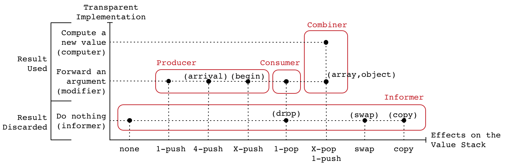

# Aran 

Aran is a [npm module](https://www.npmjs.com/package/aran) for instrumenting JavaScript code.
To install, run `npm install aran`.
Aran was designed as a generic infra-structure for building various development-time dynamic program analyses such as: objects and functions profiling, debugging, control-flow tracing, taint analysis and concolic testing.
Aran can also be used at deployment-time but be mindful of performance overhead.
For instance, Aran can be used to implement control access systems such as sandboxing.

**Disclaimer**
Aran is an academic research project, we are using it at [our lab](http://soft.vub.ac.be/soft/) to support publication and run experiments.
Although I spent a lot of time improving the quality of this software I do not claim it reached industrial strength.
Bugs may still remain and unforeseen behavior may occur on large instrumented programs.
In the near future, I will not add new features but will correct bugs reported in this repository.

## Getting Started

```sh
npm install acorn aran astring
```

```js
const Acorn = require("acorn");
const Aran = require("./lib/main.js");
const Astring = require("astring");
let depth = "";
global.ADVICE = {
  apply: (f, t, xs, serial) => {
    console.log(depth + f.name + "(" + xs.join(", ") + ")");
    depth += ".";
    const x = Reflect.apply(f, t, xs);
    depth = depth.substring(1);
    console.log(depth + x);
    return x;
  }
};
const pointcut = (name, node) =>
  name === "apply" && node.type === "CallExpression";
const aran = Aran({namespace: "ADVICE"});
global.eval(Astring.generate(aran.setup()));
const estree1 = Acorn.parse(`
  const fac = (n) => n ? n * fac(n - 1) : 1;
  fac(6);
`);
const estree2 = aran.weave(estree1, pointcut);
global.eval(Astring.generate(estree2));
```

```txt
fac(6)
.fac(5)
..fac(4)
...fac(3)
....fac(2)
.....fac(1)
......fac(0)
......1
.....1
....2
...6
..24
.120
720
```

The code transformation performed by Aran essentially consists in inserting calls to functions called *traps* at [ESTree](https://github.com/estree/estree) nodes specified by the user.
For instance, the expression `x + y` may be transformed into `META.binary("+", x, y, 123)`.
The last argument passed to traps is always a *serial* number which uniquely identifies the node which triggered the trap.
The object that contains traps is called the *advice* and the specification that characterizes what trap should be triggered on each node is called *pointcut*.
The process of inserting trap calls based on a pointcut is called *weaving*.
This terminology is borrowed from [aspect-oriented programming](https://en.wikipedia.org/wiki/Aspect-oriented_programming).
[demo/output/dead-apply-factorial.html](https://cdn.rawgit.com/lachrist/aran/9076ca66/demo/output/dead-apply-factorial.html) demonstrates these concepts.


When code weaving happens on the same process which evaluates weaved code, it is called *live weaving*.
[demo/output/live-apply-factorial.js](https://cdn.rawgit.com/lachrist/aran/9076ca66/demo/output/live-apply-factorial.html) is an example of live weaving.
Live weaving enables direct communication between an advice and its associated Aran's instance.
For instance, `aran.nodes[serial]` can be invoked by the advice to retrieve the line index of the node that triggered a trap.
Another good reason for the advice to communicate with Aran arises when the target program performs dynamic code evaluation -- e.g. by calling the evil [eval](https://developer.mozilla.org/en-US/docs/Web/JavaScript/Reference/Global_Objects/eval) function.

## Demonstrators

* [demo/live/instrument/empty-estree.js](https://cdn.rawgit.com/lachrist/aran/9076ca66/demo/output/live-empty-empty.html):
  Empty advice, do nothing aside from instrumenting the argument of direct eval calls.  
  Can be used to inspect how Aran desugars JavaScript.
* [demo/live/instrument/empty-script.js](https://cdn.rawgit.com/lachrist/aran/9076ca66/demo/output/live-empty-empty.html):
  Same as `empty-estree.js` but uses the `"script"` format option instead.
* [demo/live/instrument/forward-estree.js](https://cdn.rawgit.com/lachrist/aran/9076ca66/demo/output/live-forward-empty.html):
  Transparent implementation of all the traps.
  Can be used to inspect how Aran inserts traps.
* [demo/live/instrument/forward-script.js](https://cdn.rawgit.com/lachrist/aran/9076ca66/demo/output/live-forward-empty.html):
  Same as `forward-estree.js` but uses the `"script"` format option instead.
* [demo/live/instrument/logger.js](https://cdn.rawgit.com/lachrist/aran/9076ca66/demo/output/live-forward-empty.html):
  Same as `forward-script.js` but log the arguments and result of every trap.
* [demo/live/instrument/sandbox.js](https://cdn.rawgit.com/lachrist/aran/9076ca66/demo/output/live-sandbox-global.html):
  Demonstrate sandboxing by restricting access to `Date`.
* [demo/live/instrument/eval.js](https://cdn.rawgit.com/lachrist/aran/9076ca66/demo/output/live-eval-dynamic.html):
  Transitively intercepting dynamic code evaluation.
  [Script element](https://developer.mozilla.org/en-US/docs/Web/HTML/Element/script) insertion is not handled.
* [demo/live/instrument/shadow-value.js](https://cdn.rawgit.com/lachrist/aran/9076ca66/demo/output/live-shadow-value-delta.html):
  Track program values across the value stack and the environment but not the store (the shadow value way).
* [demo/local/instrument/shadow-state.js](https://cdn.rawgit.com/lachrist/aran/9076ca66/demo/output/live-shadow-state-delta.html):
  Track program values across the value stack and the environment but not the store (the shadow state way).
  This analysis provides the same output as the previous one.

## Limitations

<!--
// **Disclaimer**

// TRANSPARENCY ISSUE
// No closure naming for computed property in object literal:
//
// > let foo = 1;
// > ({[foo]: function(){}})[1]
// [Function: 1] -->

1) Aran performs a source-to-source code transformation fully compatible with [ECMAScript5](http://www.ecma-international.org/ecma-262/5.1/) and most of [ECMAScript2019](https://www.ecma-international.org/ecma-262/8.0/).
   Known missing features are:
   * Native modules ([`import`](https://developer.mozilla.org/en-US/docs/Web/JavaScript/Reference/Statements/import), [`export`](https://developer.mozilla.org/en-US/docs/Web/JavaScript/Reference/Statements/export)).
   * [Classes](https://developer.mozilla.org/en-US/docs/Web/JavaScript/Reference/Classes).
   * Generator functions ([`function*`](https://developer.mozilla.org/en-US/docs/Web/JavaScript/Reference/Statements/function*), [`yield`](https://developer.mozilla.org/en-US/docs/Web/JavaScript/Reference/Operators/yield),[`yield*`](https://developer.mozilla.org/en-US/docs/Web/JavaScript/Reference/Operators/yield*)).
   * Asynchronous functions ([`async function`](https://developer.mozilla.org/en-US/docs/Web/JavaScript/Reference/Statements/async_function), [`await`](https://developer.mozilla.org/en-US/docs/Web/JavaScript/Reference/Statements/async_function)).
   * [Template literals](https://developer.mozilla.org/en-US/docs/Web/JavaScript/Reference/Template_literals).
2) There exists loopholes that will cause the target program to behave differentially when analyzed, this is discussed in [Known Heisenbugs](#known-heisenbugs).
3) Aran does not provide any facilities for instrumenting modularized JavaScript applications.
   To instrument server-side node applications and client-side browser applications we rely on a separate module called [Otiluke](https://github.com/lachrist/otiluke).
   You can either combine these module manually or used [aran-lite](https://github.com/lachrist/linvail) which is simpler but also less generic.
4) Aran does not offer an out-of-the-box interface for tracking primitive values through the object graph.
   This feature is crucial for data-flow centric dynamic analyses such as taint analysis and symbolic execution.
   In our research, we track primitive values through the object graph with [aran-access](https://github.com/lachrist/linvail) which implements an acces control system around Aran's instrumented code.

## API

### Syntactic Nodes

Aran visits all the nodes of a given ESTree and completes them with the following information:

* `AranStrict :: boolean`:
  Indicates whether the node is in [strict mode](https://developer.mozilla.org/en-US/docs/Web/JavaScript/Reference/Strict_mode) or not.
* `AranSerial :: number`:
  The node's serial number.
* `AranSerialMax :: number`:
  The maximum serial number which can be found within the node's decedents.
  This is useful to speed up node search.
* `AranRoot :: object`:
  The program node from which the node originated.
  This field is not enumerable to prevent `JSON.stringify` from complaining about circularity.
* `AranRootSerial :: number`:
  The serial number of the node's root.
* `AranParent :: object | null`:
  The node's parent.
  If the node is of type `"Program"`, then this field will either refer to a direct eval call or it will be null.
  This field is not enumerable to prevent `JSON.stringify` from complaining about circularity.
* `AranParentSerial :: number | null`:
  The serial number of the node's parent (if any).

### `aran = require("aran")({namespace, format, roots})`

Create a new Aran instance.

* `namespace :: string`, default `"__ARAN__"`:
  The name of the global variable holding the advice.
* `format :: string | object`, default `"EstreeOptimized"`:
  Defines the output format of `aran.weave(root, scope)` and `aran.setup()`.
  It can be an object resembling the modules of [/lib/build](/lib/build) or one of the string:
  * `"ESTree"`:
    Regular ESTree.
  * `"ESTreeOptimized"`:
    An optimized and more compact ESTree.
    The performance cost of the optimization pass should barely be noticeable. 
  * `"ESTreeValid"`:
    Same as `"ESTree"` but performs various checks before constructing each node.
    This is useful to debug Aran itself.
  * `"String"`:
    Directly produces an unoptimized and compact code string.
    This should result in a slightly faster instrumentation than the other `format` options.
* `roots :: array`, default `[]`.
  Each `estree.Program` node passed to `aran.weave(root, scope)` will be stored in this array.
  The only reason why you would want to pass a non empty array is to duplicate an aran instance.
  ```js
  const Aran = require("aran");
  const aran1 = Aran({...});
  const serialized = JSON.stringify(aran1);
  const aran2 = Aran(JSON.parse(serialized));
  ```

### `output = aran.weave(program, pointcut, context)`

Desugar and insert calls to trap functions at nodes specified by the pointcut.
* `program :: estree.Program`:
  The [ESTree Program](https://github.com/estree/estree/blob/master/es2015.md#programs) to instrument.
* `pointcut :: array | function`:
  The specification that tells Aran where to insert trap calls.
  Two specification formats are supported:
  * `array`:
    An array containing the names of the traps to insert at every applicable cut point.
    For instance, the pointcut `["binary"]` indicates Aran to insert the `binary` traps whenever applicable.
  * `function`:
    A function that tells whether to insert a given trap at a given node.
    For instance, the pointcut below results in Aran inserting a call to the `binary` trap at every update expression:
    ```js
    const pointcut = (name, node) => name === "binary" && node.type === "UpdateExpression" ;
    ```
* context :: `object | string`, defaut `"global"`:
  * `object`:
    * `context.local :: boolean`
    * `context.closure :: boolean`
    * `context.strict :: boolean`
    * `context.identifiers :: array`
  * `string`:
    The string format is a shorthand for the more general object format.
    ```js
    {
      "global":        {local:false, closure:false, strict:false, identifiers:["this"]},
      "commonjs":      {local:false, closure:true,  strict:false, identifiers:["this", "require", "module", "exports"]},
      "node":          {local:fale,  closure:true,  strict:false, identifiers:["this", "require", "module", "exports", "__filename", "__dirname"]},
      "direct":        {local:true,  closure:false, strict:false, identifiers:[]},
      "direct-strict": {local:true,  closure:true,  strict:true,  identifiers:[]},
    }
    ```
* `output :: estree.Program | string | *`:
  The weaved code whose format depends on the `format` option.

### `aran.namespace`

The name of the global variable holding the advice.

```js
{
  value: string,
  enumerable: true,
  configurable: false,
  writable: false
}
```

### `aran.format`

The output format for `aran.weave(estree, scope)` and calls.
If a custom builder was provided, the Aran instance can no longer simply be `JSON.stringify`.

```js
{
  value: string | object,
  enumerable: true,
  configurable: false,
  writable: false
}
```

### `aran.roots`

An array of all the program nodes visited by aran.
The only reason why you would want to access this field is to serialize the Aran instance.

```js
{
  value: array,
  enumerable: true,
  configurable: false,
  writable: false
}
```

### `aran.nodes`

An array indexing all the AST node visited by the Aran instance.
This field is useful to quickly retrieve a node from its serial number: `aran.nodes[serial]`.
It is not enumerable to reduces the size of `JSON.stringify(aran)`.

`{
  value: array,
  enumerable: false,
  configurable: false,
  writable: false
}`

## Advice

In Aran, an advice is a collection of functions that will be called during the evaluation of weaved code.
These functions are called traps; they are independently optional and they all receive as last argument an integer which is the index of the ESTree node that triggered the them.

### Trap Categorization

We tried to provide as few trap as possible to express the entire JavaScript semantic.
This process still left us with around 40 traps which we categorize depending on their effect on the value stack:

* *Bystanders*: no effect on the value stack.
  Aside from `begin`, these traps receive only primitive constants and their result is discarded.
* *Producers*: push several values on top of the stack.
  Aside from `arrival`, these traps push exactly one value on top of the stack.
  Aside from `copy` and `arrival`, the pushed value corresponds to the value returned by the trap.
* *Consumers*: pop one value from the stack.
  Aside from `drop`, the popped value corresponds to the value returned by the trap.
* *Combiners*: pop several values from the value stack and push exactly one value on top of it.
  Aside from `array` and `object`, these traps should compute a new value.
* *Swappers*: swap two elements of the value stack based on their position.
  The only trap in this category is `swap`.



### Trap Insertion

Name          | Original             | Instrumented
--------------|----------------------|-------------
**Bystanders**|                      |
*Informers*   |                      |
`sandbox`     | `...` (program)      | `... begin(scope, @serial), META_HANDLERS)) { ... }`
`block`       | `{ ... }`            | `{ META.block(@serial) ... }`
`break`       | `break l;`           | `META.break(false, "l", @serial); break bl;`
`drop`        | `f();`               | `(f(), META.drop(@serial));`
`end`         | `...` (program)      | `... finally { META.end(scope, @serial); } ...`
`finally`     | `... finally { ...`  | `... finally { META.finally(@serial) ...`
`label`       | `l: { ... }`         | `bl: { META.label(false, "l", @serial); ... }`
`leave`       | `{ ... }`            | `{ ... META.leave("block", @serial); }`
`try`         | `try { ...`          | `try { META.try(@serial) ...`
*Modifiers*   |                      |
`begin`       | `...` (program)      | `... const sandbox = META.begin(strict, scope, global, @serial); ...`
**Producers** |                      | 
*Informers*   |                      |
`arrival`     | `() => { ... }`      | `... META.arrival(@strict, scope, callee, arguments, @serial); ...`
*Modifiers*   |                      |
`builtin`     | `for (x in o) ...`   | `... META.builtin("Object.keys", META._Object_keys, @serial) ...`
`catch`       | `... catch (e) ...`  | `... catch (error) { let e = META.catch(error, @serial); ...`
`closure`     | `() => {}`           | `META.closure(..., @serial)`
`discard`     | `delete x`           | `META.discard("x", delete x, @serial)`
`primitive`   | `"foo"`              | `META.primitive("foo", @serial)`
`read`        | `x`                  | `META.read("x", x, @serial)`
`regexp`      | `/abc/g`             | `META.regexp(/abc/g, @serial)`
**Consumers** |                      | 
*Informers*   |                      |
`drop`        | `f();`               | `f(); META.drop();`
*Modifiers*   |                      |
`completion`  | `"foo";`             | `completion = META.completion("foo", @serial);`
`declare`     | `let x = y`          | `let x = META.declare("let", "x", y, @serial)`
`eval`        | `eval(x)`            | `$eval === META._eval ? eval(META.eval(x, @serial)) : $eval(x)`
`failure`     | `...` (program)      | `... catch (error) { throw META.failure(scope, error, @serial); } ...`
`return`      | `return x`           | `return META.return(arrival, x, @serial)`
`success`     | `...` (program)      | `... completion = META.success(scope, completion, @serial); ...`
`test`        | `x ? y : z`          | `META.test(x, @serial) : y : z`
`throw`       | `throw x`            | `throw META.throw(x, @serial)`
`with`        | `with (x) { ... }`   | `with(new META._Proxy(META.with(x, @serial), META._WithHandlers)) { ... }`
`write`       | `x = y`              | `x = META.write("x", y, @serial)`
**Combiners** |                      |
*Modifiers*   |                      |
`array`       | `[x,y]`              | `META.array([x,y], @serial)`
`object`      | `{k:x,l:y}`          | `META.object(["k", "l"], {k:x,l:y}, @serial)`
*Computers*   |                      |
`apply`       | `f(x,y)`             | `META.apply(f, [x,y], @serial)`
`binary`      | `x + y`              | `META.binary("+", x, y, @serial)` 
`construct`   | `new F(x,y)`         | `META.construct(F, [x,y], @serial)`
`delete`      | `delete o.k`         | `META.delete(o, "k", @serial)`
`get`         | `o.k`                | `META.get(o, "k", @serial)`
`invoke`      | `o.k(x,y)`           | `META.invoke(o, "k", [x,y], @serial)`
`set`         | `o.k = x`            | `META.set(o, "k", x, @serial)`
`unary`       | `!x`                 | `META.unary("!", x, @serial)` 
**Swappers**  |                      |
*Informers*   |                      |
`swap`        | `for (x in o) ...`   | `... META.swap(1, 2, @serial) ...`

### Trap Signature

Name          | arguments[0]          | arguments[1]          | arguments[2]        | arguments[3]
--------------|-----------------------|-----------------------|---------------------|-----------------
**Combiners** |                       |                       |                     |
`apply`       | `function:value`      | `arguments:[value]`   | `serial:number`     |
`array`       | `array:value`         | `serial:number`       |                     |
`binary`      | `operator:string`     | `left:value`          | `right:value`       | `serial:number`
`construct`   | `constructor:value`   | `arguments:[value]`   | `serial:number`     |
`delete`      | `object:value`        | `key:value`           | `serial:number`     |
`get`         | `object:value`        | `key:value`           | `serial:number`     |
`invoke`      | `object:value`        | `key:value`           | `arguments:[value]` | `serial:number`
`object`      | `keys:[string]`       | `object:value`        | `serial:number`     |
`set`         | `object:value`        | `key:value`           | `value:value`       | `serial:number`
`unary`       | `operator:string`     | `argument:value`      | `serial:number`     |
**Producers** |                       |                       |                     |
`arrival`     | `strict:boolean`      | `scope:object`        | `serial:number`     |
`begin`       | `strict:boolean`      | `scope:object`        | `produced:value`    | `serial:number`
`catch`       | `produced:value`      | `serial:number`       |                     |
`closure`     | `produced:value`      | `serial:number`       |                     |
`discard`     | `identifier:string`   | `produced:value`      | `serial:number`     |
`load`        | `name:string`         | `produced:value`      | `serial:number`     |
`primitive`   | `produced:value`      | `serial:number`       |                     |
`read`        | `identifier:string`   | `produced:value`      | `serial:number`     |
`regexp`      | `produced:value`      | `serial:number`       |                     |
**Consumers** |                       |                       |                     |
`completion`  | `consumed:value`      | `serial:number`       |                     |
`declare`     | `kind:string`         | `identifier:string`   | `consumed:value`    | `serial:number`
`eval`        | `consumed:value`      | `serial:number`       |                     |
`failure`     | `scope:object`        | `consumed:value`      | `serial:number`     |
`return`      | `scope:object`        | `consumed:value`      | `serial:number`     |          
`save`        | `name:string`         | `consumed:value`      | `serial:number`     |
`success`     | `scope:object`        | `consumed:value`      | `serial:number`     |
`test`        | `consumed:value`      | `serial:number`       |                     |
`throw`       | `consumed:value`      | `serial:number`       |                     |
`with`        | `consumed:value`      | `serial:number`       |                     |
`write`       | `identifier:string`   | `consumed:value`      | `serial:number`     |
**Informers** |                       |                       |                     |
`block`       | `serial:number`       |                       |                     |
`break`       | `continue:boolean`    | `label:string`        | `serial:number`     |
`copy`        | `position:number`     | `serial:number`       |                     |
`drop`        | `serial:number`       |                       |                     |
`end`         | `scope:string`        | `serial:number`       |                     |
`finally`     | `serial:number`       |                       |                     |
`label`       | `continue:boolean`    | `label:string`        | `serial:number`     |
`leave`       | `type:string`         | `serial:number`       |                     |
`swap`        | `position1:number`    | `position2:number`    | `serial:number`     |
`try`         | `serial:number`       |                       |                     |

### Trap Comments

* `["begin", "completion", "success", "failure", "end"]`:
  These traps are linked to a program from the original code.
  The first / last trap invoked by a program is always `begin` / `end`.
  Before invoking `end`, either `success` or `failure` is invoked.
  The `completion` trap is invoked every time the completion value of a program changes.
  ```js
  // Original //
  this.Math.sqrt(4);
  ```
  ```js
  // Instrumented //
  try {
    META._Reflect_apply(function () {
      META._scope = {this:this};
      with (META._Proxy({"*inner*":META.begin(false, META._scope, META._global, 1)}, META._SandboxHandlers)) {
        const META = this;
        const eval = META._eval;
        const _this = META._scope.this;
        let completion;
        completion = META.completion(_this.Math.sqrt(4), 1);
        completion = META.success(scope, completion, 1);
        return completion;
      }
    }, META, []);
  } catch (error) {
    throw META.failure(error, 1);
  } finally {
    META.end(1);
  }
  ```
* `["closure", "arrival", "return"]`:
  These traps are linked to a closure from the original code.
  The `closure` trap intercepts the creation of the closures whether it is a function or an arrow.
  To desugar destructuring parameters, Aran always uses the `arguments` identifiers.  
  This requires to replace arrows by functions.
  The `arrival` trap receives all the information relative to entering the closure.
  Note that `callee` is assigned to the function given as parameter to the `closure` trap and not its return value.
  If the `closure` trap returns a custom value, the `arrival` traps should reflect this change in `arrival.callee` and `arrival.arguments.callee` (non strict mode only). 
  ```js
  // Original //
  const add = function (arguments0) {
    return arguments0 + arguments[1]; 
  };
  ```
  ```js
  // Instrumented //
  const add = META.closure(
    META._Object_defineProperty(
      META._Object_defineProperty(
        function callee () {
          {
            let scope = {"new.target":new.target, this, arguments, callee};
            META.arrival(false, scope, arguments, @serial1);
            var $newtarget = scope["new.target"];
            var $this = scope.this;
            var $arguments = scope.arguments;
          }
          let arguments0 = arguments[0];
          return META.return(arguments0 + $arguments[1], @serial2);
        },
        "name",
        {value:"add", configurable:true}),
      "length",
      {value:2, configurable:true}),
    @serial1);
  ```
* `["block", "leave"]`:
  There exists multiple block semantic in JavaScript, the simplest one corresponds to regular blocks.
  The legal values passed as first parameter to `leave` are: `"block"`, `"try"`, `"catch"`, `"finally"` and `"label"`.
  Each of these value corresponds to the name of the trap that might have been triggered upon entering the block.
  ```js
  // Original //
  {
    let x = "foo";
  }
  ```
  ```js
  // Instrumented //
  {
    META.block(@serial);
    let x = "foo";
    META.leave("block", @serial);
  }
  ```
* `["try", "catch", "finally", "leave"]`:
  `try`, `catch` and `finally` are each closed with a `leave` trap.
  The Aran-specific identifier `error` is used so that destructuring parameters can be desugarized.
  ```js
  // Orginal //
  try {
    f();
  } catch (e) {
    g();
  } finally {
    h();
  }
  ```
  ```js
  // Instrumented //
  try {
    META.try(@serial);
    f();
    META.leave("try", @serial)
  } catch (error) {
    let e = META.catch(error, @serial);
    g();
    META.leave("catch", @serial);
  } finally {
    META.finally(@serial);
    h();
    META.leave("finally", @serial);
  }
  ```
* `["label", "leave", "break"]`:
  We made some extra work to avoid adding a `continue` trap.
  This has beeen realized by splitting labels into two categories: break labels and continue labels.
  Explicit break / continue labels are prepended with `"b"` / `"c"`:
  ```js
  // Original //
  foo : {
    break foo;
  }
  ```
  ```js
  // Instrumented //
  bfoo: {
    META.label(false, "foo", @serial1);
    META.break(false, "foo", @serial2);
    break bfoo;
    META.leave("label", @serial1);
  }
  ```
  Implicit break / continue labels are explicitly named `"B"` / `"C"`:
  ```js
  // Original // 
  while (x) {
    break;
    continue;
  }
  ```
  ```js
  // Instrumented //
  META.label(false, null);
  B: while (x) C: {
    META.label(true, null);
    META.break(false, null);
    break B;
    META.break(true, null);
    break: C;
    META.leave("label");
  }
  META.leave("label");
  ```
  To make these two transformations invisible to the user we added a boolean parameter to the `label` and `break`.
  This parameter tells whether the label is a break label (false) or a continue label (true).
* `["array", "object"]`:
  These traps are the only combiner traps whose transparent implementation simply consists in returning one of their argument.
  The object trap receives as first arguments an array of unique keys which indicates the order in which the data properties were assign to the object.
  Literal objects containing computed keys or accessor properties or non-unique keys will result in an empty object being passed to the `object` trap.
* `["save", "load"]`:
  These traps are only important for analyses that mirror the cares about the value stack.
  Some structures require builtin values to be desugarized.
  For instance a `for ... in` loop can be desugarized into `for` loops with the help of `Object.getPrototypeOf` and `Object.keys`.
  As the target programs can modify the global object, we created a save/load system to make sure we access the correct builtin values.
  Analyses that mirror the value stack should also mirror this mapping as shown below:
  ```js
  // Advice //
  let mapping = {};
  advice.save = (name, value, serial) => {
    mapping[name] = vstack.pop();
    return value;
  };
  advice.load = (name, value, serial) => {
    vstack.push(mapping[name]);
    return value;
  };
  ```
* `["copy", "drop", "swap"]`:
  These traps are only important for analyses that cares about the value stack.
  They each express a simple manipulation of the value stack as examplified below:
  ```js
  // Advice //
  advice.copy = (position, serial) => {
    vstack.push(vstack[vstack.length-position]);
  };
  advice.swap = (position1, position2, serial) => {
    const temporary = vstack[vstack.length-position1];
    vstack[vstack.length-position1] = vstack[vstack.length-position2];
    vstack[vstack.length-position2] = temporary;
  };
  advice.drop = (serial) => {
    vstack.pop();
  };
  ```

## Known Heisenbugs

When dynamically analyzing a program, it is implicitly assumed that the analysis will conserve its behavior.
If this is not the case, the analysis might draw erroneous conclusions.
Behavioral divergences caused by analyses over the target programs are called [heisenbugs](https://en.wikipedia.org/wiki/Heisenbug).
Here are the known heisenbugs that Aran may introduce by itself:

* *Performance Overhead*:
  A program being dynamically analyzed will necessarily perform slower.
  Events might interleave in a different order or malicious code might detect the overhead.
  Unfortunately there is no general solution to this problem. 
* *Code Reification*:
  Whenever the target program can obtain a representation of itself, the original code should be returned and not its instrumented version.
  [`Function.prototype.toString`](https://developer.mozilla.org/en-US/docs/Web/JavaScript/Reference/Global_Objects/Function/toString) and [`ScriptElement.textContent`](https://developer.mozilla.org/en-US/docs/Web/API/Node/textContent) are both instance of code reification.
  Aran does not deal with code reification at the moment.
* *Modified Global Variables*:
  To prevent clashes, Aran sanitizes identifiers with a function similar to: 
  ```js
  function sanitize (identifier) {
    if (identifier === "new.target")
      return "$newtarget";
    if (/^\$*(completion|error|newtarget|this|arguments|eval)$/.test(identifier))
      return "$$" + identifier;
    if (/^\$*META/)
      return "$$" + identifier;
    return identifier;
  }
  ```
  If a modified identifier is actually a global variable, the global object will differ.
  Consider the code below, it will output `foo foo undefined` but will output `foo undefined foo` under an empty Aran analysis.
  ```js
  // Original //
  var error = "foo";
  console.log(error, global.error, global.$$error);
  ```
  ```js
  // Instrumented (pointcut = []) //
  var $$error = "foo";
  console.log($$error, global.error, global.$$error);
  ```
  This heisenbug can be alleviated by turning the sandbox option on.
* *Access to the Advice*:
  Consider the snippet below which makes the advice available as a global variable.
  If the `script` code accesses the `global.META`, havoc will ensue. 
  ```js
  global.META = {};
  const aran = Aran({namespace:"META"});
  global.eval(Astring.generate(aran.setup());
  global.eval(Astring.generate(aran.weave(script)));
  ```
  This heisenbug can be alleviated by locally defining the advice and using direct eval calls.
  ```js
  const META = {};
  cons aran = Aran({namespace:"META" /*sandbox:true*/});
  // const sandbox = global;
  eval(Astring.generate(aran.setup()));
  eval(Astring.generate(aran.weave(script)));
  ```
  However this is not a complete solution because although the `META` identifier is sanitized, `aran` is still accessible from the target program.
  A complete solution can be obtained by turning the sandbox option on.
  In that case, only the lookup of `META` will be able to reach to outside scope.
* *Temporal Deadzone*:
  Aran's `declare` trap cannot express the temporal deadzone introduced by [let](https://developer.mozilla.org/en-US/docs/Web/JavaScript/Reference/Statements/let) and [const](https://developer.mozilla.org/en-US/docs/Web/JavaScript/Reference/Statements/const).
  To properly model temporal deadzones, a new trap expressing that a variable is defined within a block but not yet declared should be added.
  This can cause heisenbugs on analyses modeling the environment.
  Moreover, the `typeof` operator does not behave the same in Aran itself when applied on identifier in the temporal deadzone.
  Normally the code below should fail at the `typeof` line but it won't after inserting the `unary` trap:
  ```js
  // Original //
  {
    typeof x;
    const x;
  }
  ```
  ```js
  // Instrumented (pointcut = ["unary"]) //
  {
    META.unary("typeof", (function () {
      try { return x } catch (error) {}
      return void 0;
    } ()));
    const x;
  }
  ```
* *Arguments' Numerical Properties*:
  Some analyses like [`demo/local/analysis/shadow-value.js`](demo/local/analysis/shadow-value.js) threat values differently when they are get/set to object than when they are read/written to the environment.
  In non strict mode, the [arguments object](https://developer.mozilla.org/en-US/docs/Web/JavaScript/Reference/Functions/arguments) blurs this distinction which can lead to heisenbugs.
  In the code below, the `write` trap should be triggered with `"x"` and `"bar"` to account to for the sneaky variable assignment but it is not at the moment. 
  ```js
  function f (x) {
    arguments[0] = "bar";
    console.log(x); // prints "bar"
  }
  f("foo");
  ```
* *Computed Methods' Name*
  Aran use a simple static analysis to compute functions' name.
  It works in most case but cannot cope with computed poperty keys.
  Normally, the expression below should evaluates to `"f"`.
  But in Aran, it evalaluates to `""`.
  ```js
  ({["f"]:()=>{}}).f.name
  ```
* *Constructor's TypeError Message*:
  Aran transforms arrow into functions which throws an type error when used as constructor.
  Normally the below code should throw `TypeError: bar is not a constructor`.
  But in Aran, it throws `TypeError: foo is not a constructor`. 
  ```js
  const foo = () => {};
  const bar = foo;
  new bar();
  ```

<!--
## Improvements Idea
* Pass actual scope instead of puzzling `{callee,this,new,arguments}`; e.g. `{this,new.target,arguments,x0,x1}`.
  Clearer semantic but analyses keeping the arguments and the variables in sync is challenging in the presence of destructuring assignment and spread syntax.
 -->

## Implementation

### Side Effects

- scope.binding[name].declared
- scope.binding[name].static 
- ARAN.node
- ARAN.counter

## Acknowledgments

I'm [Laurent Christophe](http://soft.vub.ac.be/soft/members/lachrist) a phd student at the Vrij Universiteit of Brussel (VUB).
I'm working at the SOFT language lab in close relation with my promoters [Coen De Roover](http://soft.vub.ac.be/soft/members/cderoove) and [Wolfgang De Meuter](http://soft.vub.ac.be/soft/members/wdmeuter).
I'm currently being employed on the [Tearless](http://soft.vub.ac.be/tearless/pages/index.html) project.


## Discussion

[Aran](https://github.com/lachrist/aran) and program transformation in general is good for introspecting the control flow and pointers data flow.
Things become more difficult when reasoning about primitive value data flow is involved.
For instance, there is no way at the JavaScript language level to differentiate two `null` values even though they have different origins.
This restriction strikes every JavaScript primitive values because they are inlined into different parts of the program's state -- e.g the environment and the value stack.
All of these copying blur the concept of a primitive value's identity and lifetime.
By opposition, objects can be properly differentiated based on their address in the store.
Such situation happens in almost every mainstream programming languages.
We now discuss several strategies to provide an identity to primitive values:
* *Shadow States*:
  For low-level languages such as binary code, primitive values are often tracked by maintaining a so called "shadow state" that mirrors the concrete program state.
  This shadow state contains analysis-related information about the program values situated at the same location in the concrete state. 
  [Valgrind](http://valgrind.org/) is a popular binary instrumentation framework which utilizes this technique to enables many data-flow analyses.
  The difficulty of this technique lies in maintaining the shadow state as non-instrumented functions are being executed.
  In JavaScript this problem typically arises when objects are passed to non instrumented functions such as builtins.
  Keeping the shadow store in sync during such operation requires to know the exact semantic of the non-instrumented function. 
  Since they are so many different builtin functions in JavaScript, this is a very hard thing to do.
* *Record And Replay*:
  Record and replay systems such as [Jalangi](https://github.com/SRA-SiliconValley/jalangi) are an intelligent response to the challenge of keeping in sync the shadow state with its concrete state.
  Acknowledging that divergences between shadow and concrete states cannot be completely avoided, these systems allows divergences in the replay phase which can be recovered from by utilizing the trace gathered during the record phase.
  We propose two arguments against such technique:
  First, every time divergences are resolved in the replay phase, values with unknown origin are being introduced which necessarily diminish the precision of the resulting analysis.
  Second, the replay phase only provide information about partial execution which can be puzzling to reason about.
* *Wrappers*:
  Instead of providing an entire separated shadow state, wrappers constitute a finer grained solution.
  By wrapping primitive values inside objects we can simply let them propagate through the data flow of the base program.
  The challenge introduced by wrappers is to make them behave like their wrapped primitive value to non-transformed code.
  We explore three solutions to this challenge:
  * *Boxed Values*:
    JavaScript enables to box booleans, numbers and strings.
    Despite that symbols, `undefined` and `null` cannot be tracked by this method, boxed values do not always behave like their primitive counterpart within builtins.    
    ```js
    // Strings cannot be differentiated based on their origin
    let string1 = "abc";
    let string2 = "abc";
    assert(string1 === string2);
    // Boxed strings can be differentiated based on their origin
    let boxed_string1 = new String("abc");
    let boxed_string2 = new String("abc");
    assert(boxed_string1 !== boxed_string2);
    // Boxed value behave as primitive in some builtins: 
    assert(JSON.stringify({a:string1}) === JSON.stringify({a:boxed_string1}));
    // In others, they don't...
    let error
    try {
      Object.defineProperty(string1, "foo", {value:"bar"});
    } catch (e) {
      error = e;
    }
    assert(error);
    Object.defineProperty(boxed_string1, "foo", {value:"bar"});
    ```
  * *`valueOf` Method*:
    A similar mechanism to boxed value is to use the `valueOf` method.
    Many JavaScript builtins expecting a primitive value but receiving an object will try to convert this object into a primitive using its `valueOf` method.
    As for boxed values this solution is not bullet proof and there exists many cases where the `valueOf` method will not be invoked.
  * *Explicit Wrappers*:
    Finally a last option consists in using explicit wrappers which should be cleaned up before escaping to non-instrumented code.
    This requires to setup an access control system between instrumented code and non-instrumented code.
    This the solution this module directly enables.

## Acknowledgments

I'm [Laurent Christophe](http://soft.vub.ac.be/soft/members/lachrist) a phd student at the Vrij Universiteit of Brussel (VUB).
I'm working at the SOFT language lab, my promoters are [Coen De Roover](http://soft.vub.ac.be/soft/members/cderoove) and [Wolfgang De Meuter](http://soft.vub.ac.be/soft/members/wdmeuter).
I'm currently being employed on the [Tearless](http://soft.vub.ac.be/tearless/pages/index.html) project.

<!-- Improvements ideas:
Provide a much more fine grained membrane definition.
This membrane can easily express the actual membrane and is symetric.
I suspect I will be able to use a single foreign file instead of generating the dual.
```
membrane = {
  instrument: (script, serial) => ...,
  enter_primitive: (primitive) => ...,
  enter_native_wild: (native_wild) => ...,
  enter_native_tame: (native_tame) => ...,
  leave_wild: (inner) => ...,
  leave_tame: (inner) => ...,
};
```
 -->

<!-- 
1. **Debugging NaN appearances**
  In this first example, we want to provide an analysis which tracks the origin of `NaN` (not-a-number) values.
  The problem with `NaN` values is that they can easily propagate as the program is executed such that detecting the original cause of a `NaN` appearance is often tedious for large programs.
  Consider the program below which alerts "Your age is: NaN".
  ```js
  var year = Number(document.getElementById("bdate").avlue);
  // many lines with many unrelated NaNs appearances
  alert("Your age is: " + (2016 - year));
  ```
  Simply printing every appearance of `NaN` values runs under the risk of overwhelming the programmer with unrelated `NaN` appearances.
  We would like to know only of the `NaN` that caused the alert to display an buggy message.
  It is therefore crucial to differentiate `NaN` values which cannot be done at the JavaScript language level.

2. **Taint analysis**
  Taint analysis consists in marking -- or *tainting* -- values coming from predefined source of information and preventing them from flowing through predefined sinks of information.
  As tainted values are manipulated through the program, the taint should be properly propagated to dependent values. 
  ```js
  var password = document.getElementById("password"); // predefined source
  var secret = password.value; // tainted string
  var secrets = secret.split(""); // array of tainted characters
  sendToShadyThirdPartyServer(secrets); // predefined sink
  ```
  Lets suppose that the password was `"trustno1"`.
  N.B. strings are primitive values in JavaScript.
  After splitting this string to characters we cannot simply taint all string being `"t"`, `"r"`, `"u"`, `"s"`, `"t"`, "`n`", "`o`", `"1"`.
  This would lead to serious over-tainting and diminish the precision and usefulness of the analysis.
  As for the `Nan` debugger we crucially need to differentiate primitive values based on their origin and not only their value.

3. **Concolic Testing**
  Concolic testing aims at automatically exploring all the control-flow paths a program can take for validation purpose.
  It involves gathering mathematic formula on a program's inputs as it is being executed.
  Later, these formula can be given to a constraint solver to steer the program into a unexplored execution path.
  Consider the program below which has two different outcomes based on the birthdate of the user.
  A successful concolic tester should be able to generate an birthdate input that leads the program to the consequent branch and an other birthdate input that leads the program to the alternate branch.
  ```js
  var input = document.getElemenById("bdate").value;
  var bdate = input.value // new symbolic value [α]
  var age = bdate - 2016; // new constraint [β = α - 2016]
  var isminor = age > 17; // new constraint [γ = β > 17]
  if (isminor) {          // path condition [γ && γ = β > 17 && β = α - 2016]
    // do something
  } else {                // path condition [!γ && γ = β > 17 && β = α - 2016]
    // do something else
  }
  ```
  It should be clear that confusing two primitive values having different origin would easily lead to erroneous path constraint.
 -->
